# Road Traffic Management System 🚦

# Project Description 📄
The Road Traffic Management System is a web application designed to efficiently manage road traffic data, such as accidents, vehicle violations, and camera operations. It allows users to perform various database queries using complex SQL operations such as set operations, subqueries with WITH clauses, advanced aggregates, and OLAP queries. The system also provides a user-friendly interface for CRUD operations, and features robust error handling to ensure smooth user experience.

# Features ✨
- **Complex SQL Queries:**
  
  - **Set Operations:** Union, Intersect, Difference, Symmetric Difference.
  - **Subqueries with CTE:** Total fines, road accidents, user violations.
  - **Advanced Aggregate Queries:** Rollup, running totals, and averages.
  - **OLAP Queries:** Ranking, partitioning, and percentage contribution.
 
- **User-Friendly Interface**:

    - Intuitive navigation with dropdown menus and buttons.
    - Interactive query execution with real-time results display.
   
- **CRUD Operations**:

    - Create, View, Update, and Delete records in all tables
   
- **Error Handling**:
      
    - Provides meaningful error messages for invalid operations.
    - Ensures graceful degradation and prevents application crashes.
 
# **Technologies Used** 💻

- Backend: Flask (Python)
- Frontend: HTML, CSS, Bootstrap
- Database: MySQL
- Other Tools:
  - Loom for demonstration video
  - Git for version control
 
# Installation 🛠️

Follow these steps to set up and run the project on your local machine:

## Prerequisites:

- Python 3.8 or above
- MySQL server
- Required Python libraries (listed in requirements.txt)

## Steps to run the project

1. Clone the repository:

```bash
https://github.com/asarath12/Dbo_project_deliverable_5.git
```

2. Install the required Python packages:

```bash
pip install -r requirements.txt
```

3. Update the database connection credentials in the code:

```bash
db = DatabaseManager(host="localhost", user="root", password="YourPassword", database="YourDatabase")
```
Ensure the database schema is set up with the required tables and relationships.

4. Run the application:

```bash
python .\run.py
```

5. Access the application at http://127.0.0.1:8000.

## How to Use 🚀

### Running Queries:

  - Navigate to the Complex Queries section.
  - Select a query type (e.g., Set Operations, Subquery with CTE, OLAP Queries) from the dropdown.
  - View and analyze the results on a new page.

### CRUD Operations: 

  - Use the Manage Records section to Create, View, Update, or Delete records.
  - Ensure proper IDs and values are provided for valid operations.

# Screenshots of website 📸

## Home Page 

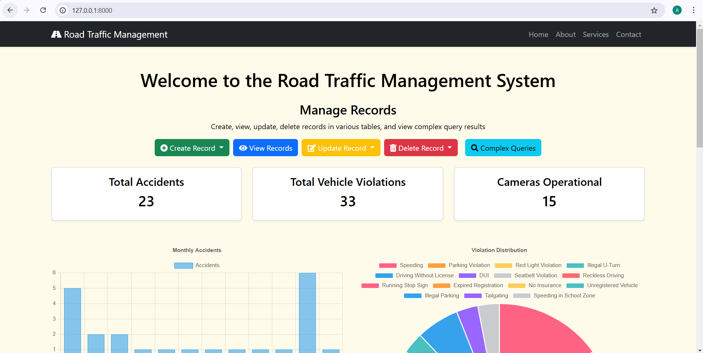

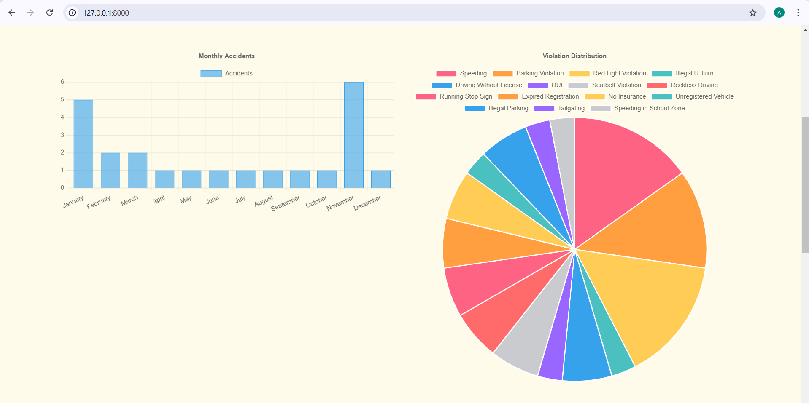

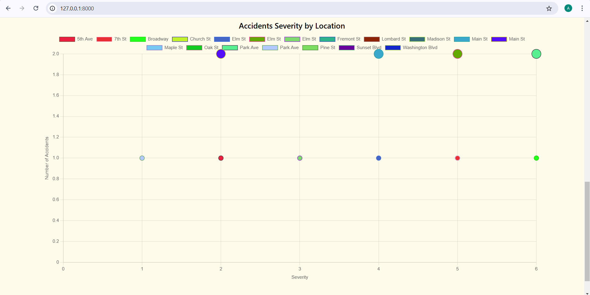

## Complex Queries Page

This section outlines the different complex SQL queries integrated into the application. Each query demonstrates advanced database functionality, and the outputs are displayed in a user-friendly interface.

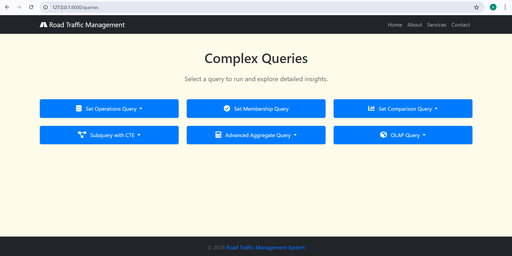

### **Set Operation** :

The following queries combine datasets using SQL set operations:

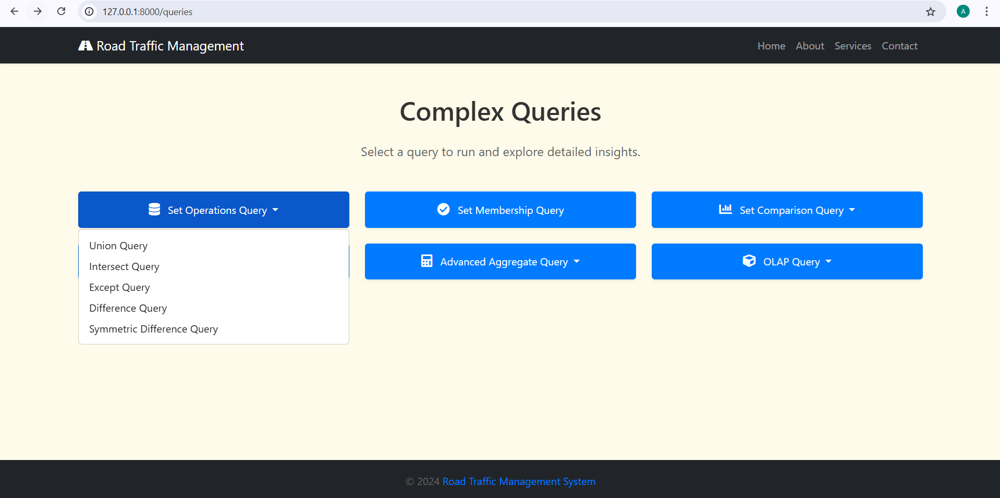

  - **Union Query:** Combines results from two datasets, ensuring all distinct records from both datasets are included.

  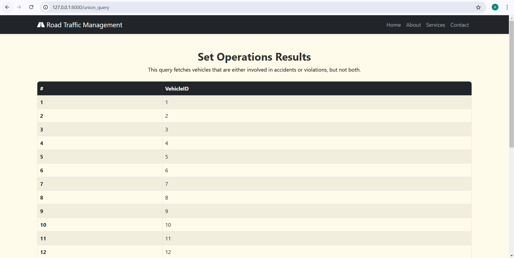
  
  - **Intersect Query:** Returns common records between datasets.
    
  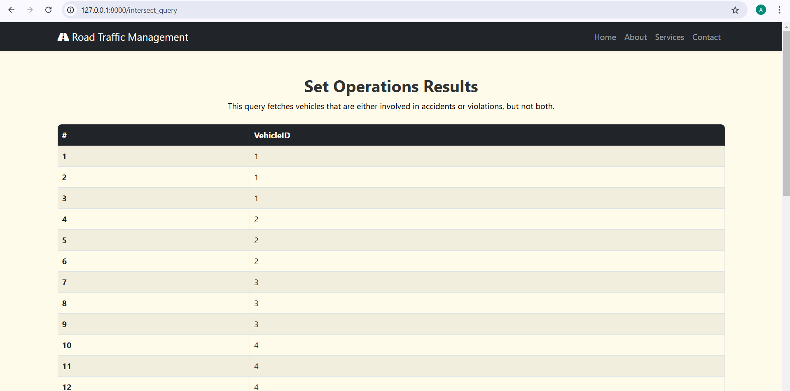
  
  - **Except Query:** Displays records in one dataset but not the other.
    
  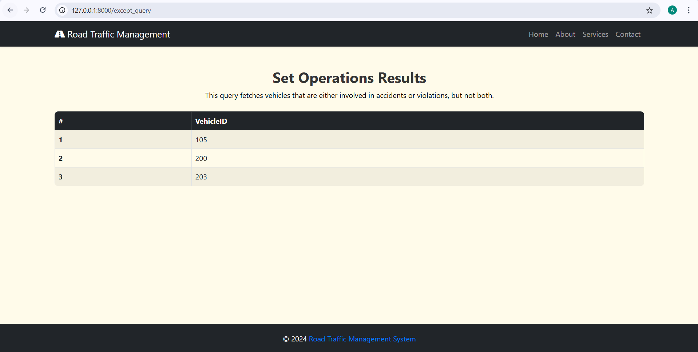
  
  - **Difference Query:** Calculates the absolute differences between two datasets.

  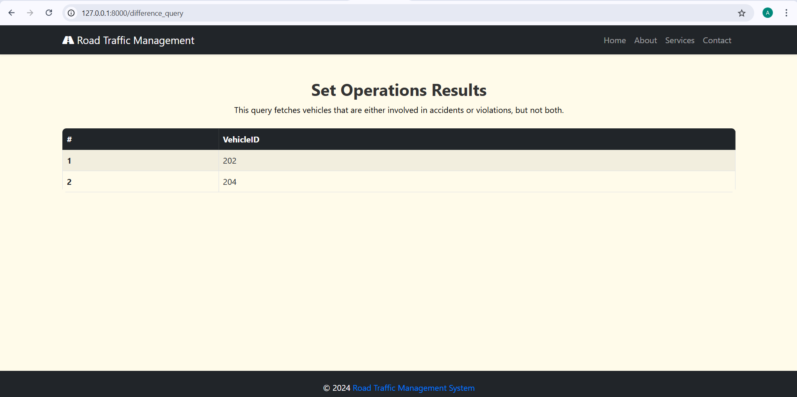
  
  - **Symmetric Difference Query:** Finds records in either dataset but not in both.

  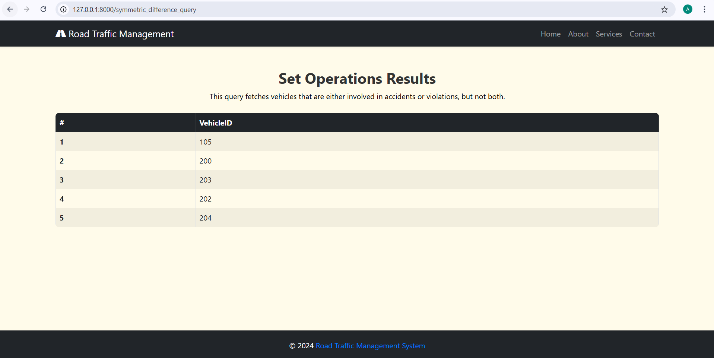

  ### **Set Membership** :

The Set Membership Query checks whether a specific VehicleID exists in both the accident and vehicleviolation tables. This query is particularly useful for identifying vehicles that are involved in both accidents and violations, allowing for targeted analysis or reporting.


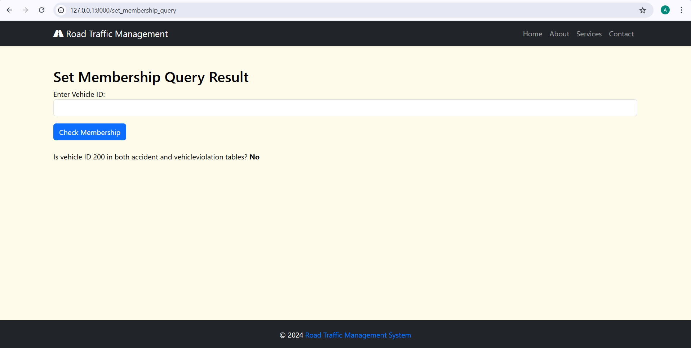

  - **Description of the Screenshot:**
The screenshot demonstrates the result of the set membership query for VehicleID 200. The output states, "No," indicating that the vehicle is not present in both the accident and vehicleviolation tables.

### **Set Comparison** :

Set comparison queries allow us to analyze data relationships and extract insights by comparing records across various tables.

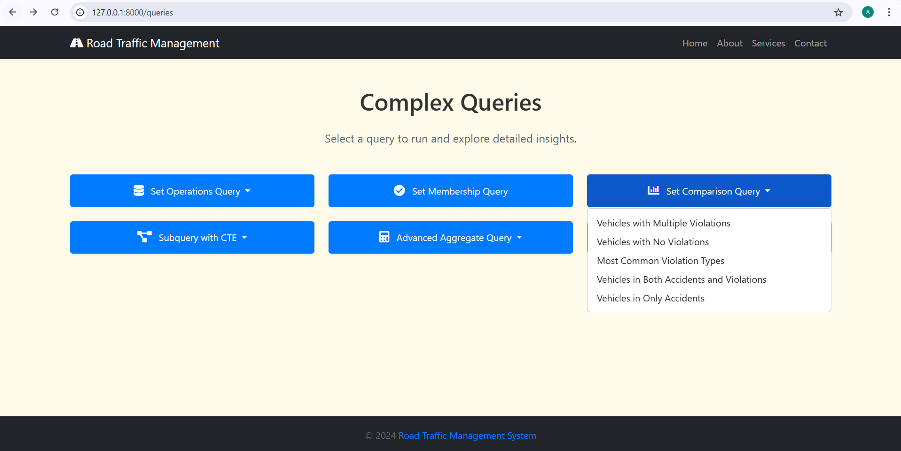

- **Vehicles with Multiple Violations:** This query lists all vehicles that have committed multiple violations, showing the total count of violations per vehicle.

  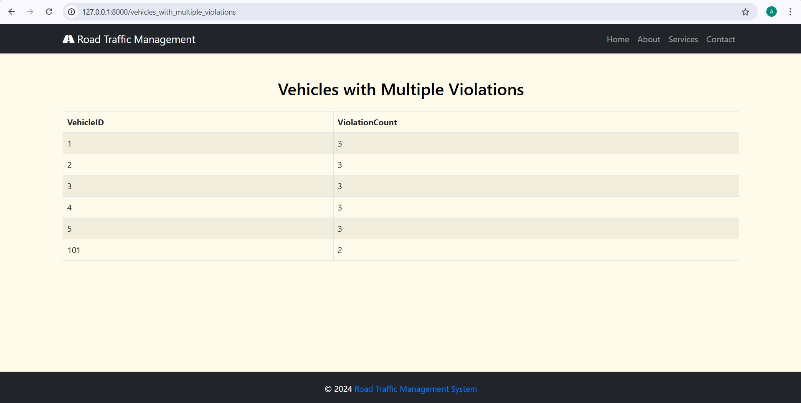

- **Vehicles with No Violations:** This query displays vehicles that have no violations recorded. These vehicles are registered but have a clean record.

  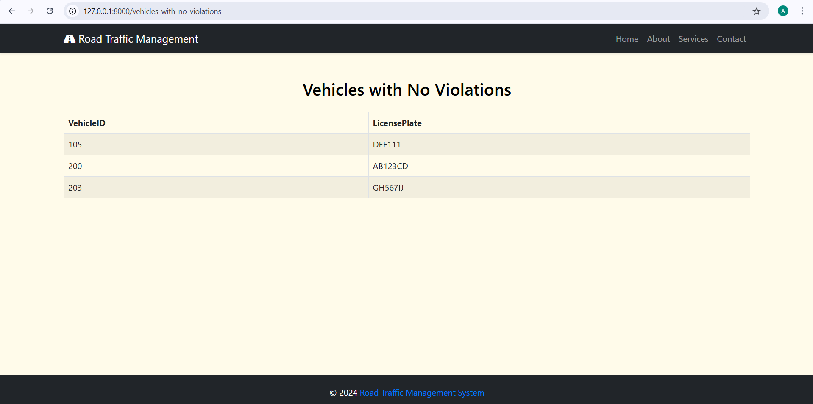
  
- **Most Common Violation Types:** This query identifies and ranks the most frequent violation types along with their occurrence counts, helping to focus on major infraction areas.

  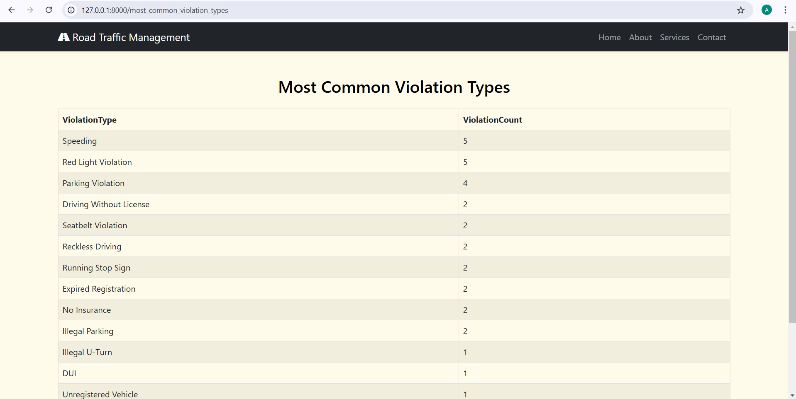
  
- **Vehicles in Both Accidents and Violations:** This query lists vehicles involved in both accidents and violations, signifying cases where the same vehicles have been repeatedly flagged.

  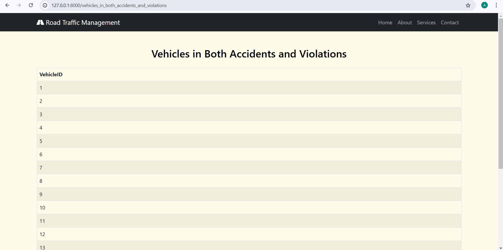
  
- **Vehicles in Only Accidents:** This query identifies vehicles that have been involved exclusively in accidents and have no recorded violations.

  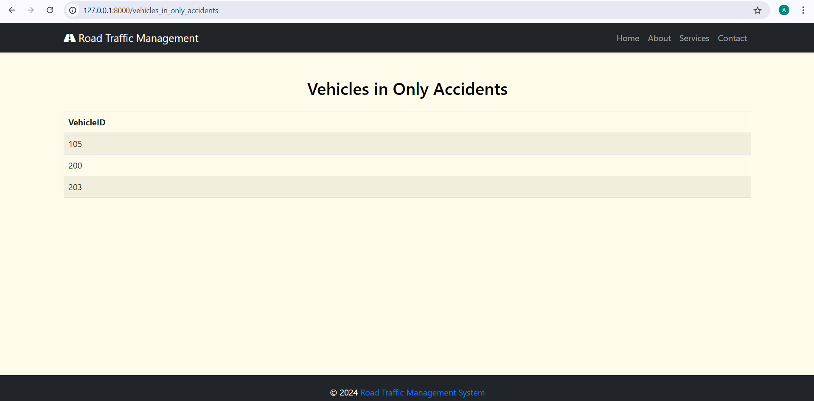

  ### **Subquery with WITH clause** :

The Subquery with WITH Clause utilizes Common Table Expressions (CTE) to simplify complex queries by breaking them into manageable parts.

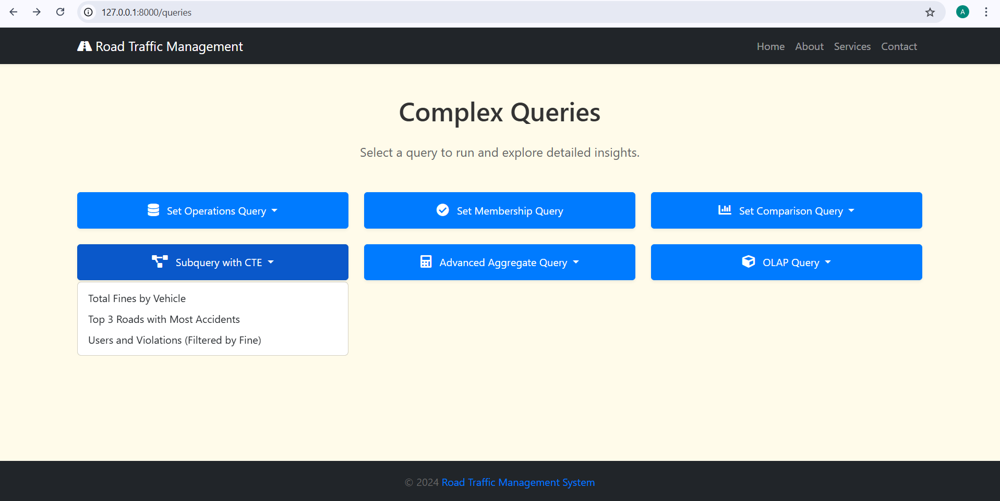

- **Total Fines by Vehicle:** This page lists the total fines incurred by each vehicle. This data allows easy identification of vehicles with the highest fine amounts, useful for enforcement or compliance reviews.

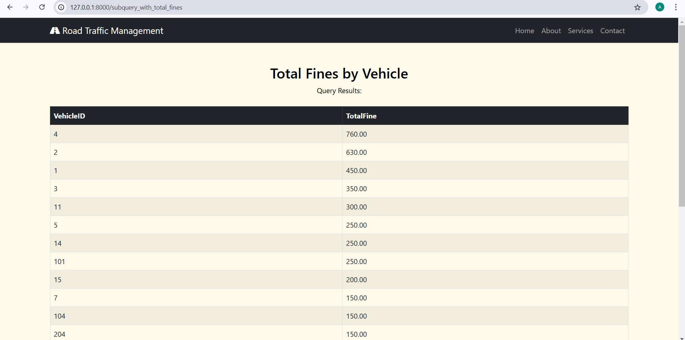

- **Top 3 Roads with Most Accidents:** This page lists the total fines incurred by each vehicle. This data allows easy identification of vehicles with the highest fine amounts, useful for enforcement or compliance reviews.

  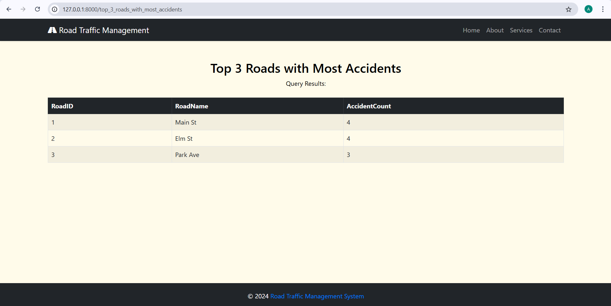

- **Users and Vehicle Violations:** This page displays a detailed list of users along with their vehicle violations. This helps in understanding which users and vehicles are involved in specific violations and the fines associated.

  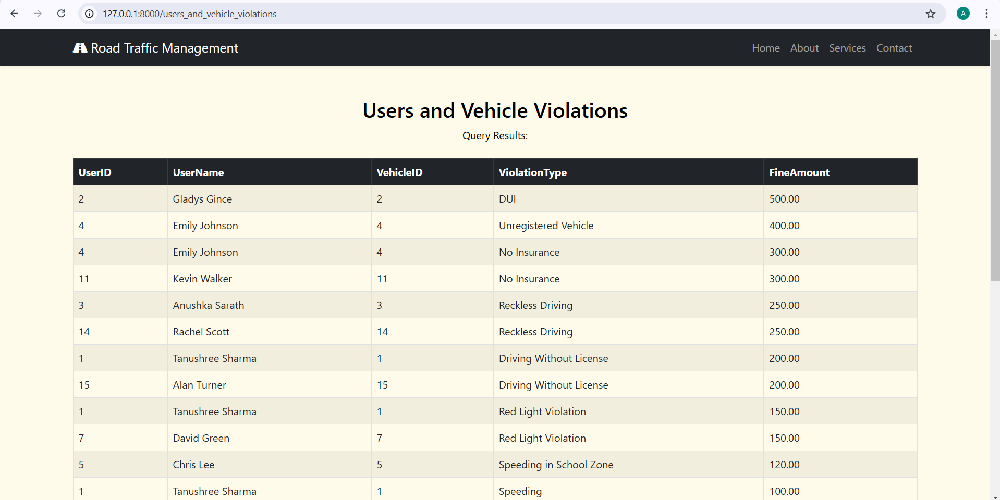

# Demonstration 🎥

Watch the full functionality demonstration of the application on Loom: Loom Video Link
