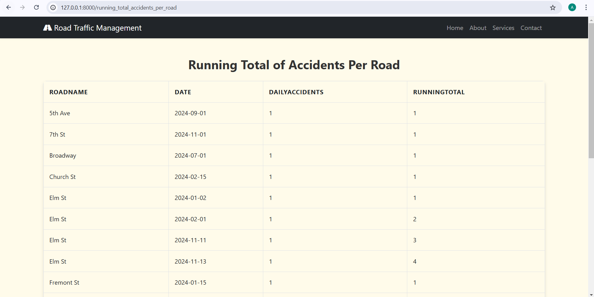
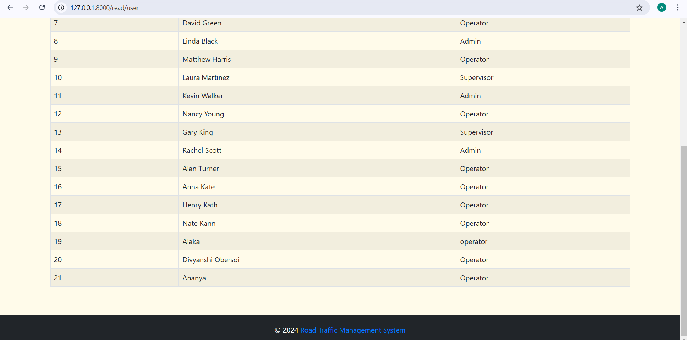
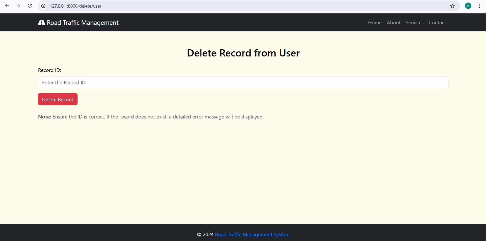
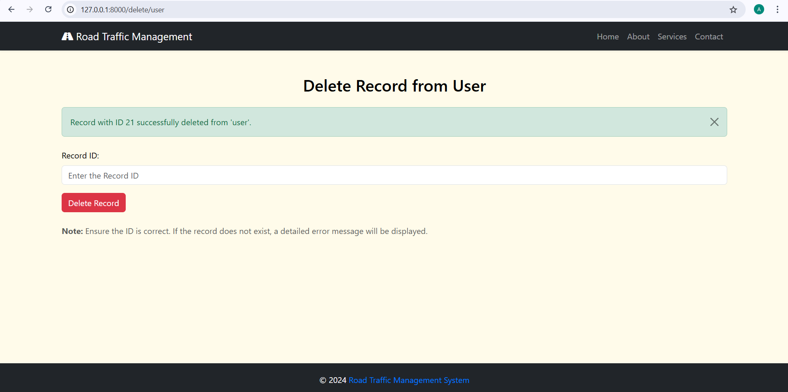
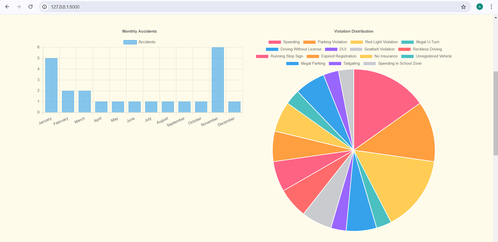

# Road Traffic Management System 🚦

# Project Description 📄
The Road Traffic Management System is a web application designed to efficiently manage road traffic data, such as accidents, vehicle violations, and camera operations. It allows users to perform various database queries using complex SQL operations such as set operations, subqueries with WITH clauses, advanced aggregates, and OLAP queries. The system also provides a user-friendly interface for CRUD operations, and features robust error handling to ensure smooth user experience.

# Features ✨
- **Complex SQL Queries:**
  
  - **Set Operations:** Union, Intersect, Difference, Symmetric Difference.
  - **Subqueries with CTE:** Total fines, road accidents, user violations.
  - **Advanced Aggregate Queries:** Rollup, running totals, and averages.
  - **OLAP Queries:** Ranking, partitioning, and percentage contribution.
 
- **User-Friendly Interface**:

    - Intuitive navigation with dropdown menus and buttons.
    - Interactive query execution with real-time results display.
   
- **CRUD Operations**:

    - Create, View, Update, and Delete records in all tables
   
- **Error Handling**:
      
    - Provides meaningful error messages for invalid operations.
    - Ensures graceful degradation and prevents application crashes.
 
# **Technologies Used** 💻

- Backend: Flask (Python)
- Frontend: HTML, CSS, Bootstrap
- Database: MySQL
- Other Tools:
  - Loom for demonstration video
  - Git for version control
 
# Installation 🛠️

Follow these steps to set up and run the project on your local machine:

## Prerequisites:

- Python 3.8 or above
- MySQL server
- Required Python libraries (listed in requirements.txt)

## Steps to run the project

1. Clone the repository:

```bash
https://github.com/asarath12/Dbo_project_deliverable_5.git
```

2. Install the required Python packages:

```bash
pip install -r requirements.txt
```

3. Update the database connection credentials in the code:

```bash
db = DatabaseManager(host="localhost", user="root", password="YourPassword", database="YourDatabase")
```
Ensure the database schema is set up with the required tables and relationships.

4. Run the application:

```bash
python .\run.py
```

5. Access the application at http://127.0.0.1:8000.

## How to Use 🚀

### Running Queries:

  - Navigate to the Complex Queries section.
  - Select a query type (e.g., Set Operations, Subquery with CTE, OLAP Queries) from the dropdown.
  - View and analyze the results on a new page.

### CRUD Operations: 

  - Use the Manage Records section to Create, View, Update, or Delete records.
  - Ensure proper IDs and values are provided for valid operations.

# Screenshots of website 📸

## Home Page 


## Complex Queries Page

This section outlines the different complex SQL queries integrated into the application. Each query demonstrates advanced database functionality, and the outputs are displayed in a user-friendly interface.


### **Set Operation** :

The following queries combine datasets using SQL set operations:


  - **Union Query:** Combines results from two datasets, ensuring all distinct records from both datasets are included.

  
  
  - **Intersect Query:** Returns common records between datasets.
    
  
  
  - **Except Query:** Displays records in one dataset but not the other.
    
  
  
  - **Difference Query:** Calculates the absolute differences between two datasets.

  
  
  - **Symmetric Difference Query:** Finds records in either dataset but not in both.

  

  ### **Set Membership** :

The Set Membership Query checks whether a specific VehicleID exists in both the accident and vehicleviolation tables. This query is particularly useful for identifying vehicles that are involved in both accidents and violations, allowing for targeted analysis or reporting.


  - **Description of the Screenshot:**
The screenshot demonstrates the result of the set membership query for VehicleID 200. The output states, "No," indicating that the vehicle is not present in both the accident and vehicleviolation tables.

### **Set Comparison** :

Set comparison queries allow us to analyze data relationships and extract insights by comparing records across various tables.


- **Vehicles with Multiple Violations:** This query lists all vehicles that have committed multiple violations, showing the total count of violations per vehicle.

  

- **Vehicles with No Violations:** This query displays vehicles that have no violations recorded. These vehicles are registered but have a clean record.

  
  
- **Most Common Violation Types:** This query identifies and ranks the most frequent violation types along with their occurrence counts, helping to focus on major infraction areas.

  
  
- **Vehicles in Both Accidents and Violations:** This query lists vehicles involved in both accidents and violations, signifying cases where the same vehicles have been repeatedly flagged.

  
  
- **Vehicles in Only Accidents:** This query identifies vehicles that have been involved exclusively in accidents and have no recorded violations.

  

  ### **Subquery with WITH clause** :

The Subquery with WITH Clause utilizes Common Table Expressions (CTE) to simplify complex queries by breaking them into manageable parts.


- **Total Fines by Vehicle:** This page lists the total fines incurred by each vehicle. This data allows easy identification of vehicles with the highest fine amounts, useful for enforcement or compliance reviews.


- **Top 3 Roads with Most Accidents:** This page lists the total fines incurred by each vehicle. This data allows easy identification of vehicles with the highest fine amounts, useful for enforcement or compliance reviews.

  

- **Users and Vehicle Violations:** This page displays a detailed list of users along with their vehicle violations. This helps in understanding which users and vehicles are involved in specific violations and the fines associated.

  

   ### **Advanced Aggregate Query** :

  The Advanced Aggregate Query feature is designed to provide deeper insights into traffic and violation data using complex SQL aggregations

  

  - **Accidents by Severity(WITH ROLLUP):** Categorizes accidents by severity levels (e.g., Fatal, High, Low) and includes subtotals, aiding in understanding the distribution of accidents by severity.
 
  

  - **Average Fine Per Violation Type:** Lists the average fine amount for each type of violation. Useful for understanding which violations impose higher financial penalties.
 
  
 
  - **Running Total of Accidents Per Road:** Displays the daily accident count for each road and its cumulative total. This helps track trends and monitor accident hotspots over time.
 
  

  ### **OLAP Query** :

  OLAP queries facilitate complex data analysis by slicing, dicing, and aggregating large datasets. 

  

  - **Fine Ranking Per Vehicle:** This query ranks vehicles based on the fine amounts incurred. It provides a hierarchical ordering of fines for each vehicle.
 
  

  - **Percentage Contribution of Accidents:** This query calculates the percentage contribution of accidents for each road, highlighting roads with the highest accident shares.
    
  
 
  - **Partitioned Sum of Fines:** This query groups violations by type and calculates the total fine for each violation category, offering an aggregate view of fines.
 
  

## CRUD Operations

  ### Create Functionality

**Purpose:** The "Create" functionality allows users to add new records to the database through a simple and intuitive form interface.

- **Steps** :

   - The dashboard provides a dropdown menu for creating records in different tables such as Accident, Address, Vehicle, etc., making the system versatile and efficient.
 
     

  - The screenshot displays a form to create a new user record in the "User" table. Fields like Userid, Username, and Userrole are filled in, and clicking "Submit" adds the record to the database. It displays a message on the screen that the record has been successfully entered into the database.
 
    

    

### Read Functionality

**Purpose:** The Read Functionality allows users to view the records stored in the database for various entities like accidents, vehicles, users, and more.

- **Steps** :

   - Select a Table: The user is presented with a list of available tables (Accident, Address, Camera, etc.) to choose from.
 
     

  - Display Records: Once a table is selected, all the records from that table are displayed in a structured format with proper headers for clarity.
 
  - User Table Example: As shown, the User table displays columns like UserID, UserName, and UserRole with all stored records visible. It also shows the record number 21 that we entered in the database.
 
    

    

  ### Update Functionality

  **Purpose:** The Update functionality allows users to modify existing records in the database through a simple interface.

  - **Steps** :

   - Select a Table to Update: From the dashboard, users can choose the "Update Record" option and select the desired table to modify.
 
     

  - Enter Record Details: The ID of the record to be updated is specified, The specific column to update (e.g., UserName, UserRole) is selected from a dropdown, The new value for the selected column is entered and click on Update Record. A success message is displayed confirming the record update.
 
    

    

  - Check the database to view the updated record.
 
    

    

    ### Delete Functionality

    **Purpose:** The delete functionality in the Road Traffic Management System allows users to remove records from specific tables in the database.

    - **Steps** :

     - Users can navigate to the delete functionality by selecting the "Delete Record" option from the homepage dropdown. They can choose the specific table (e.g., User, Road, Violation) they want to delete records from.
   
       

    - Once a table is selected, a form appears where the user can input the Record ID of the item to be deleted.
   
      

    - After submitting the form, the system validates the input and deletes the corresponding record from the database. A success message confirms that the record was successfully removed, or an error message is displayed if the ID does not exist.
   
      

      

    - You can view record of the table to check if the record has been deleted or not. We can see that the record has been deleted from the database.
   
      

      

# Visualizations

Bar chart, Pie chart and Bubble chart visualization is shown in our home page. The data is directly fetched from the database.

### 1. Monthly Accidents and Violation Distribution



- **Bar Chart**: This chart showcases the total accidents for each month, helping identify patterns or spikes, such as increased accidents in January and November.
  
- **Pie Chart**: Highlights the distribution of different traffic violations, with each segment representing a specific type of violation (e.g., Speeding, DUI). This aids in determining the most common offenses.

### 2. Accident Severity by Location


- **Bubble Chart**: Maps accident severity (x-axis) against the number of occurrences (y-axis) for different locations. Each bubble is color-coded for a specific street, making it easy to identify high-risk areas and accident severity trends.

These visualizations provide actionable insights into accident trends and violation patterns, supporting better traffic management and policy-making.

# Additional Pages

### About Us

The "About Us" page introduces the **Road Traffic Management System**, highlighting its mission and core values:

- **Description:** This platform is dedicated to efficiently managing traffic-related data using innovative solutions and user-friendly interfaces.

**Screenshot:**


---

### Our Services
The "Our Services" page outlines the range of functionalities provided by the system:
- **Accident and traffic data management**
- **Real-time violation monitoring**
- **Comprehensive road and camera system management**

This page helps users understand the features offered and how they contribute to better traffic management.

**Screenshot:**


---

### Contact Us
The "Contact Us" page provides essential information for collaboration and support:
- **Email:** `contact@roadtraffic.com`
- **Phone:** `(555) 555-5555`

Users can reach out for inquiries, technical assistance, or partnerships.

**Screenshot:**


  
# Demonstration 🎥

Watch the full functionality demonstration of the application on Loom: [Loom Video Link](https://www.loom.com/share/6b41b306782e41f09bffb00cc8938c67?sid=f8cf1368-185c-40a1-b0b9-8c94b6a5aa6c)
